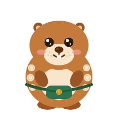
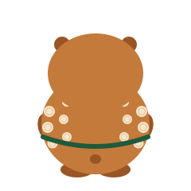
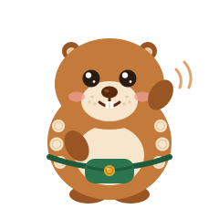
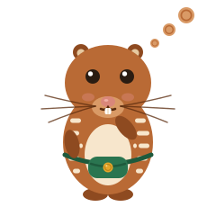
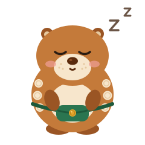
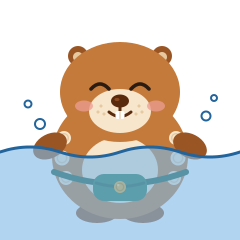
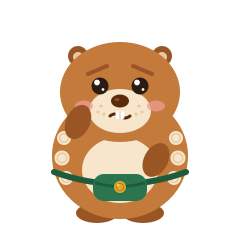
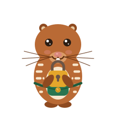
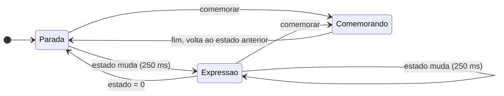
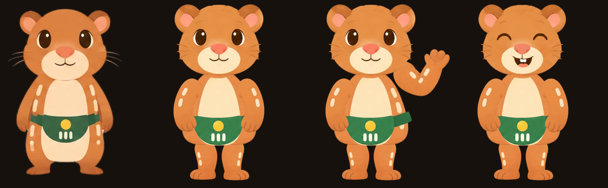

# Parte 3: Mascote

A Paçoca está desenhada em 12 SVGs: 3 vistas e 9 expressões, todas geradas pelas mesmas peças. Eles servem de referência para a ilustração final no Rive e de quadro parado dentro do app.

- **Data:** 2026-11-10
- **Arquivos:** pasta [`mascote`](mascote/). Para regenerar depois de mudar uma peça: `node docs/design/mascote/gerar-pacoca.mjs`.

## Folha de modelo

| Frente | Perfil | Costas |
|---|---|---|
|  |  |  |

- **Corpo:** esguio, como nas fotos de paca usadas de referência. De frente ela fica em pé, para os gestos; de perfil e andando, fica em quatro patas, com a garupa alta.
- **Cara de paca:** focinho alongado com nariz rosado, orelhas pequenas e bigodes longos. Os dentes da frente aparecem só com a boca aberta.
- **Listras de pintas:** fileiras de traços creme, longos e curtos, que acompanham o comprimento do corpo, como na paca de verdade. De lado, são quatro fileiras na horizontal, com pintas curtas em cima e traços longos embaixo. Em pé, o corpo fica na vertical e as fileiras também: duas colunas em cada lateral. São a marca registrada dela.
- **Pochete:** em Mata, com a fivela de moeda em Milho. De costas, aparece só a alça.
- **Traço:** vetorial plano, formas redondas, sem contorno preto e no máximo 3 tons por cor.

| Cor | Tons |
|---|---|
| Caramelo do corpo | #D99A66, #B96A35, #8E4A20 |
| Creme (focinho, barriga e pintas) | #F7E6CC, #E6C9A0 |
| Pochete | #2A7550, #1E5A3C |
| Moedas | #F7D27A, #E5A62B, #B98318 |
| Olhos, boca e bigodes | #2A1C12, #5A2A0C |
| Nariz | #F0B0A6, #D9877A |

A Paçoca tem as mesmas cores nos dois temas. O caramelo do corpo fica acima de 3:1 nos quatro fundos: 3,74:1 no fundo Paçoca, 4,06:1 na Superfície clara, 4,61:1 no fundo escuro e 4,22:1 na Superfície escura.

## Expressões

| Desenho | Expressão | Quando aparece | `estado` no Rive |
|---|---|---|---|
|  | Acenando | Boas-vindas e guia inicial | 1 |
|  | Comemorando, com moedinhas pulando | Meta batida, mês com sobra | 2 |
|  | Pensando, com a pata no queixo e três pintas no lugar do balão | IA processando, chat digitando | 3 |
|  | Com lupa | Lendo nota fiscal ou comprovante | 4 |
|  | Dormindo | Sem internet, sincronização pendente | 5 |
|  | Mergulhando | Atualizando os dados ao puxar a tela | 6 |
|  | Preocupada, sem drama | Alertas e conexão vencendo | 7 |
|  | Segurando um cadeado | Telas de privacidade e segurança | 8 |
|  | Andando, deixando pegadas | Trilha do primeiro acesso | 9 |

O `estado` 0 é a Paçoca parada, igual à vista de frente.

## Regras de uso

- **No máximo uma vez por tela.**
- **Nunca** em listas de transações, nem ao lado de valor negativo em tom de piada.
- **Em alerta,** só a preocupada, sem drama. Em erro que envolve dinheiro, ela não brinca.
- **Fundo:** Superfície, fundo Paçoca ou a ilustração da trilha. Nunca sobre foto nem sobre a cor de um banco.
- **Não mexer no desenho:** sem recolorir, esticar, girar ou pôr contorno.
- **Texto fora do desenho:** as falas vão num balão ao lado, no estilo `falaPacoca` (Baloo 2 18).
- **Leitor de tela:** quando a frase ao lado já diz o estado, a Paçoca é decorativa e fica fora da leitura. Quando ela é o único sinal, ganha rótulo, como "A Paçoca está dormindo: sem internet".

| Uso | Tamanho | Recorte |
|---|---|---|
| Avatar do chat | 40 px | Só a cabeça |
| Puxar para atualizar | 48 px | Mergulhando |
| Fala da Paçoca num cartão | 64 px | Corpo inteiro |
| Estado vazio | 120 px | Corpo inteiro |
| Primeiro acesso | 160 a 240 px | Corpo inteiro |

Abaixo de 48 px, só a cabeça: o corpo vira um borrão e as pintas somem.

## Máquina de estados no Rive

O arquivo `pacoca.riv` tem dois artboards: **Paçoca** (512 × 512, corpo inteiro) e **Cabeça** (256 × 256, para o avatar do chat). Uma máquina de estados, `pacoca`, controla os dois.

| Entrada | Tipo | Valores | Para quê |
|---|---|---|---|
| `estado` | Número | 0 a 9, como na tabela de expressões | O app troca conforme a situação |
| `profundidade` | Número | 0 a 100 | Quanto ela já mergulhou ao puxar a tela |
| `comemorar` | Gatilho | — | Chuva de moedas de 1,2 s, depois volta ao estado anterior |

```mermaid
stateDiagram-v2
    direction LR
    [*] --> Parada
    Parada --> Expressao: estado muda (250 ms)
    Expressao --> Expressao: estado muda (250 ms)
    Expressao --> Parada: estado = 0
    Parada --> Comemorando: comemorar
    Expressao --> Comemorando: comemorar
    Comemorando --> Parada: fim, volta ao estado anterior
```

- **Camadas:** pose (os estados acima), olhos (piscada a cada 3 a 6 s, desligada quando ela dorme, comemora ou mergulha) e respiração (escala de 1,00 a 1,02 em 4 s, em loop).
- **Transições:** 250 ms com a curva `padrao`. Para dormir, 400 ms.
- **Quadros parados:** os SVGs desta pasta vão para `assets/pacoca/`. O app usa o SVG no lugar da animação com "reduzir movimento" ligado, nos testes de golden e na demo web enquanto o Rive carrega.
- [Conferir: pub.dev/packages/rive, a API de máquina de estados e de entradas no runtime atual para Flutter.]

## Paçoca ilustrada

As telas da [Parte 6](06-telas-a.md) em diante usam a Paçoca ilustrada: 12 poses em [`mascote/ilustrada`](mascote/ilustrada), com fundo transparente.

| Pasta ou arquivo | O que é |
|---|---|
| `origem/pacoca-NN-nome.png` | A arte de cada pose sobre fundo branco, sem perda. É a entrada. |
| `pacoca-NN-nome.png` | A pose recortada, com transparência suave. É o que o app e as telas usam. |
| `recorte.mjs` | Gera os recortes e o `telas/pacoca-mini.json`. |
| `partes.mjs` | Gera a pose de frente separada em partes, com a animação de exemplo. |

### Como o recorte é feito

- **O problema do recorte simples:** apagar o branco deixa a borda serrilhada e uma franja clara, porque os pixels da borda são uma mistura do desenho com o fundo.
- **O que o `recorte.mjs` faz:** para cada pixel da borda, procura em volta a cor do interior que melhor explica aquele pixel como mistura com o branco. A transparência é a proporção dessa mistura, e a cor do pixel passa a ser a cor limpa.
- **Bigodes:** são finos demais para ter interior. Usam a cor dos seus pixels mais escuros.
- **Brancos que ficam:** o brilho dos olhos fica sozinho, por estar cercado de cor escura. Os dentes ficam por uma lista de exceções no script.
- **Conferência automática:** o recorte posto de volta sobre o branco tem de dar a imagem de origem. O script falha se mais de 0,5% dos pixels fugir disso (hoje, no máximo 0,10%).
- **Para regenerar:** `npm install --no-save --prefix docs/design sharp` uma vez, depois `node docs/design/mascote/ilustrada/recorte.mjs` e `node docs/design/telas/gerar-telas-a.mjs`.

### Pose em partes, para animar

A pose de frente está separada em **corpo**, **cabeça** e **olhos**. O corpo sobe 6 px por baixo da cabeça, para a junta do pescoço não abrir quando ela gira. A animação de exemplo respira, inclina a cabeça 2,2° e pisca; com "reduzir movimento" ligado, fica parada.

- **No Rive:** importar o PNG recortado, cortar as mesmas partes e usar as mesmas medidas (pivô da cabeça em 108, 130; olhos em 71, 62 e 144, 62) [Conferir: rive.app/docs, importação de imagens e malhas].
- **Peças soltas, para montar e animar:** [`mascote/ilustrada/partes`](mascote/ilustrada/partes) tem 10 peças desenhadas inteiras (cabeça, cabeça de olhos fechados, tronco, pochete, dois braços, duas pernas, braço acenando e boca aberta). Vieram de 5 folhas geradas no ChatGPT; a melhor versão de cada peça foi escolhida e recortada com o `recorte.mjs`. O `boneco.mjs` monta a Paçoca nos estados parada, acenando e feliz.

- **Ainda a melhorar nas peças:** a cabeça tem um tufo de pelo no topo e a máscara creme no focinho, e lê mais como ursinho do que a pose aprovada. Ao acenar, aparece a ponta do cinto do lado direito.
- **Versão vetorial descartada por enquanto:** o traçado automático achata o sombreado suave em placas de cor e fica pior que a ilustração. Vetor só vale com redesenho à mão ou com uma arte de origem já chapada.

## A conferir

- **Ilustração final:** estes SVGs fixam proporções, cores e poses. A versão do Rive pode refinar curvas e detalhes, desde que mantenha essas três coisas e as regras acima.

## Próximo

Parte 4: logo e ícone do app.
